# 🦅 DocuPilot: Multimodal Agentic Document Intelligence

**DocuPilot** is an advanced Multimodal AI System designed to analyze complex legal and financial documents (NDAs, MSAs, Invoices) with human-level precision. It bridges the gap between **Computer Vision** (PaddleOCR) and **Reasoning** (ERNIE-4.0 via Baidu AI Studio), creating a verifiable Multi-Agent workflow.

> 🏆 **Hackathon Submission**: Best ERNIE Multimodal Application using Baidu AI Studio API
> 🚀 **Live Demo**: [https://docu-pilot.streamlit.app/](https://docu-pilot.streamlit.app/)

## ✨ Key Features

*   **🤖 Multi-Agent Architecture**:
    *   **Ingestion Agent**: Clean structural OCR and layout analysis.
    *   **Analyst Agent**: Extracts "Parties", "Key Dates", "Obligations" into strict JSON.
    *   **Risk Agent**: Identifies Regulatory, Financial, and Legal risks (High/Medium/Low).
    *   **Verifier Agent**: Cross-checks summary claims against raw evidence (Hallucination prevention).
*   **👁️ Hybrid VLM Pipeline**: Decoupled Perception (PaddleOCR) and Reasoning (LLM) for full traceability.
*   **⚡ GPU Acceleration**: Optimized for Novita.ai / Baidu Cloud instances.
*   **🌐 Public Access**: Auto-tunneling via Serveo for instant cloud demos.

## 🏗️ System Architecture

```mermaid
graph TD
    User([👤 User]) -->|Upload PDF| UI["🖥️ Streamlit UI"]
    UI -->|Raw Bytes| OCR["👁️ Perception Layer<br/>(PaddleOCR)"]
    
    subgraph "Main Protocol"
        OCR -->|Layout & Text blocks| Normalizer["Describe & Structure<br/>(Evidence Store)"]
        Normalizer --> Orch{🤖 Orchestrator}
        
        Orch -->|Chunks| Analyst["🕵️ Analyst  Agent<br/>(Entity Extraction)"]
        Orch -->|Clauses| Risk["⚠️ Risk Agent<br/>(Compliance Check)"]
        
        Analyst -->|JSON| Aggregator["Reducer / Merger"]
        Risk -->|Risks| Aggregator
        
        Aggregator --> Summary["📝 Summarizer Agent"]
        Summary -->|Draft| Verifier["🛡️ Verifier Agent<br/>(Anti-Hallucination)"]
        
        Verifier -->|Checked Report| Final["JSON Report"]
    end
    
    Final --> UI
    
    subgraph "External AI"
        Analyst <-->|API| ERNIE["🧠 Baidu ERNIE-4.0"]
        Risk <-->|API| ERNIE
        Summary <-->|API| ERNIE
        Verifier <-->|API| ERNIE
    end
    
    style ERNIE fill:#f9f,stroke:#333
    style UI fill:#aff,stroke:#333
    style OCR fill:#faa,stroke:#333
```



## 🚀 Quick Start (Local)

1.  **Install**:
    ```bash
    python3 -m venv venv && source venv/bin/activate
    pip install -r requirements.txt
    ```

2.  **Configure**:
    *   Copy `.env.example` to `.env`
    *   Set `ERNIE_API_KEY` and `ERNIE_SECRET_KEY`.

3.  **Run UI**:
    ```bash
    streamlit run src/app.py
    ```
    Access at: `http://localhost:8501`

## ☁️ Cloud Deployment (Novita.ai)

DocuPilot is optimized for GPU Cloud Instances.

1.  **Setup**:
    ```bash
    git clone ... && cd docupilot
    ./setup_env.sh  # Installs system dependencies (GL, Poppler, etc.)
    ```

2.  **Launch**:
    ```bash
    python3 start_remote.py
    ```
    *   **Automated**: Binds to Port 8000.
    *   **Public Tunnel**: Automatically generates a `https://....serveo.net` link for external access.

## 🛠️ Tech Stack

*   **Backend**: Python 3.12, LangChain (Custom Agents)
*   **AI/LLM**: ERNIE-4.0 (via **Baidu AI Studio API**)
*   **OCR**: PaddleOCR (Vision Layer)
*   **Frontend**: Streamlit
