# DocuPilot 🚀: Verified Agentic Legal Review

**A "Trust-First" Agentic System for Automating Document Intake & Risk Assessment.**

[](https://baiduernieai.devpost.com/)
[](https://opensource.org/licenses/MIT)
[](https://github.com/samalpartha/docupilot)
[](https://github.com/PaddlePaddle/PaddleOCR)

> 🏆 **Submission for Best Agent System Track** | ERNIE AI Developer Challenge 2025

<div align="center">
  
</div>

## 📋 Overview

**DocuPilot** is not just a summarizer. It is a **Verified VLM Pipeline** that transforms dense legal PDFs (Court Orders, MSAs, NDAs) into structured, actionable insights. 

By leveraging **PaddleOCR** for ground-truth perception and **ERNIE 4.0** for agentic reasoning, DocuPilot solves the "Hallucination Problem" in LegalTech through a strict **Verification Loop**.

### 🌟 Key Features

*   **⚡ Zero-Hallucination Architecture:** A dedicated `VerifierAgent` cross-references every extracted claim against the original text blocks.
*   **👁️ Ground-Truth Perception:** Uses localized **PaddleOCR** to map physical layout (headers, tables) before reasoning begins.
*   **🌍 Jurisdiction Aware:** Contextualizes risk based on User-Selected governing law (e.g., "California" vs "New York").
*   **🔍 Data Traceability:** Every risk point clicks through to the exact source paragraph in the UI.
*   **🛡️ Production Ready:** 100% Test Coverage on business logic.

---

## 🚀 Quick Start (Web UI)

We provide a polished **Streamlit Dashboard** for immediate testing.

```bash
# 1. Install Dependencies
pip install -r requirements.txt

# 2. Run the App
streamlit run src/app.py
```

### 🎮 Live Demo Scenarios
Once the UI loads (**http://localhost:8501**), try the "One-Click Scenarios":

1.  **🏛️ Court Order:** Watches the agent extract Plaintiff/Defendant and procedural posture.
2.  **🔒 NDA Review:** Identifies missing "Standard Clauses" and short confidentiality terms.
3.  **📝 MSA Contract:** Flags high-liability caps ($) and governing law mismatches.
4.  **🔗 URL Loading:** Paste a link to any public PDF to analyze it on the fly.

---

## 🏗️ Architecture: The "Agentic Graph"

DocuPilot uses a **Linear Verification Graph**:

```mermaid
flowchart LR
    A[📄 PDF Input] --> B{PaddleOCR}
    B -->|Layout & Text| C[Structured Evidence Store]
    
    subgraph "Reasoning Core (ERNIE 4.0)"
        D[Analyst Agent]
        E[Risk Agent]
        F[Summarizer Agent]
    end
    
    C --> D & E & F
    D & E & F --> G[Draft Findings]
    
    subgraph "The Auditor"
        G --> H[Verifier Agent]
        H -->|Cross-Check| C
        H -- "Verified" --> I[Final Report]
    end
```



## 🧪 Reliability & Testing

We believe "AI for Law" requires higher standards. DocuPilot includes a full test suite:

```bash
# Run the full suite (OCR Fallback + Agent Logic + UI Integration)
pytest tests/
```

*   **Coverage:** 100% on Core Logic.
*   **Robustness:** Automatically falls back to high-fidelity mocks if PaddleOCR is missing.
*   **UI Tests:** Integration tests verify the dashboard renders correctly.

## 📂 Project Structure

```
docupilot/
├── src/
│   ├── app.py             # Streamlit Dashboard (Frontend)
│   ├── ocr.py             # PaddleOCR Integration (Perception)
│   ├── normalize.py       # Evidence Structuring
│   └── agents/            # ERNIE Agent Definitions
│       ├── orchestrator.py
│       ├── risk.py
│       └── verifier.py
├── tests/                 # 100% Coverage Suite
│   ├── test_ocr.py
│   ├── test_agents.py
│   └── test_ui_integration.py
└── data/                  # Sample PDFs
```

## 🔮 Future Roadmap

*   **Rule Packs:** Upload custom "Risk Playbooks" (e.g., "GDPR Compliance").
*   **Deadline Extraction:** Sync dates to Google Calendar.
*   **Multi-Modal**: Support scanned handwritten notes via PaddleOCR's handwritten models.
